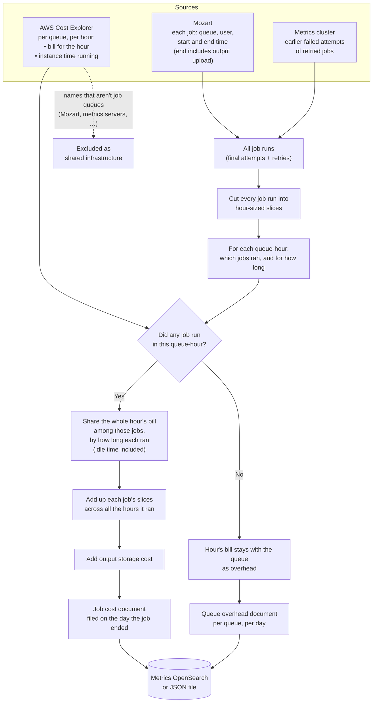
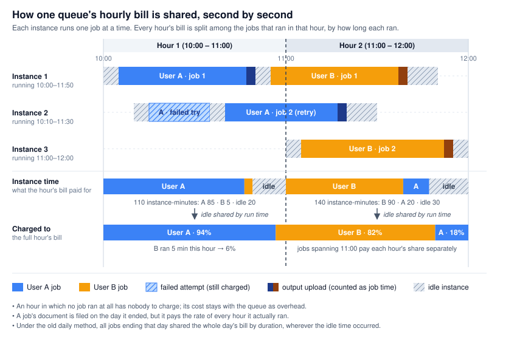

# How hourly cost attribution works

## Pipeline

```mermaid
flowchart TD
    subgraph Sources
        CE["AWS Cost Explorer<br/>per queue, per hour:<br/>• bill for the hour<br/>• instance time running"]
        MZ["Mozart<br/>each job: queue, user,<br/>start and end time<br/>(end includes output upload)"]
        MT["Metrics cluster<br/>earlier failed attempts<br/>of retried jobs"]
    end

    MZ --> JOBS["All job runs<br/>(final attempts + retries)"]
    MT --> JOBS

    JOBS --> SLICE["Cut every job run into<br/>hour-sized slices"]
    SLICE --> OCC["For each queue-hour:<br/>which jobs ran, and for how long"]
    CE --> MATCH
    OCC --> MATCH{"Did any job run<br/>in this queue-hour?"}

    MATCH -- "Yes" --> SHARE["Share the whole hour's bill<br/>among those jobs,<br/>by how long each ran<br/>(idle time included)"]
    MATCH -- "No" --> OVER["Hour's bill stays with the queue<br/>as overhead"]

    SHARE --> SUM["Add up each job's slices<br/>across all the hours it ran"]
    SUM --> S3["Add output storage cost"]
    S3 --> JD["Job cost document<br/>filed on the day the job ended"]
    OVER --> QD["Queue overhead document<br/>per queue, per day"]

    JD --> OUT[("Metrics OpenSearch<br/>or JSON file")]
    QD --> OUT

    CE -. "names that aren't job queues<br/>(Mozart, metrics servers, …)" .-> INFRA["Excluded as<br/>shared infrastructure"]
```

## Per-second attribution over time

